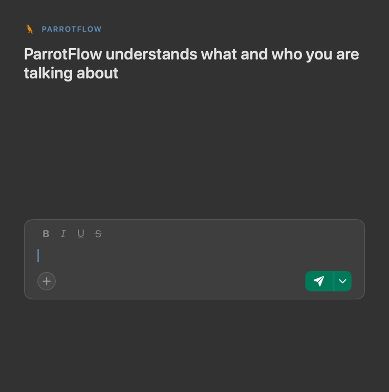

<div align="center">


# ParrotFlow

## Local and extensible dictation for macOS

[](https://github.com/znat/parrotflow/releases)


**[Install](#install)** · [Documentation](docs/README.md)




</div>

> [!TIP]
>   PR links and Slack mentions are NOT features — they are extensions configured in `yaml`!
>   You can hack them and add more in minutes with your coding agent!
>
>   Some built-in extensions you can use and play with:
>
>   🔇 **Hesitations, repeats and false starts** — `um` and `uh`, a word said twice, a phrase begun again.
>   *"so uh in the ter in the terminal run the the tests"* → *"so in the terminal run the tests"*
>
>   🔢 **Numbers, dates and times** — written as digits, English and French.
>   *"March third at quarter past nine"* → *"March 3 at 9:15"* &nbsp;·&nbsp; *"two hundred forty three tests, ninety seven percent"* → *"243 tests, 97%"*


<br>

## Truly local and extensible

**ParrotFlow uses very small models**, such as mmBERT, the Qwen3 0.6B family and spaCy, to understand what you mean, use your vocabulary in context, correct hesitations and repair raw ASR output without relying on a powerful LLM to rewrite what you said.


<table>
<thead>
<tr><th></th><th>ParrotFlow</th><th>Local<sup>1</sup></th><th>Cloud<sup>2</sup></th></tr>
</thead>
<tbody>
<tr><td>🔒 <b>Truly local</b></td><td align="center">✅</td><td align="center">✅</td><td align="center">❌</td></tr>
<tr><td>✍️ <b>Keeps your wording</b><sup>3</sup> — no LLM rewrites it</td><td align="center">✅</td><td align="center">❌</td><td align="center">❌</td></tr>
<tr><td>📖 <b>Knows your vocabulary</b> — and where it belongs</td><td align="center">✅</td><td align="center">❌</td><td align="center">❌</td></tr>
<tr><td>🧩 <b>Extensible</b> — your own rules, prompts and scripts</td><td align="center">✅</td><td align="center">❌</td><td align="center">❌</td></tr>
<tr><td>🔑 <b>No cloud key</b> — for any built-in step</td><td align="center">✅</td><td align="center">❌<sup>4</sup></td><td align="center">❌</td></tr>
</tbody>
</table>

<sub><sup>1</sup> Handy, VoiceInk, MacWhisper, FluidVoice. &nbsp;<sup>2</sup> Wispr Flow, Aqua, Willow. &nbsp;<sup>3</sup> Built-in steps never rewrite. A prompt step that does is yours to add. &nbsp;<sup>4</sup> FluidVoice bundles a local rewrite model.</sub>

<br>

## Install

ParrotFlow needs Apple silicon and macOS 15+. It uses about 3 GB of disk and 1 GB of memory.

```sh
brew install znat/tap/parrotflow
```

<details>
<summary>Not using <a href="https://brew.sh">Homebrew</a>?</summary>

<br>

The script installs the same app, in the same place.

```sh
curl -fsSL https://raw.githubusercontent.com/znat/parrotflow/main/scripts/install.sh | sh
```

</details>

<br>

## Extend with rules, prompts and scripts

> [!TIP]
> These examples show how the demo features are made.

What makes ParrotFlow truly unique is that you can fully customize it with regular expressions, prompts or scripts.
All you have to do is point your coding agent to your `config.yaml` file and ask what you need.

<br>

**Example: add PR links to your dictations**

```yaml
transforms:
  - name: github_refs
    description: spoken PR and issue numbers as links
    replace:
      '[#$1](https://github.com/OWNER/REPO/pull/$1)':
        ['/\b(?:pull request|PR)\s*(?:(?:number|nr|no|hash)\s+)?#?(\d+)\b/']
```

> *"merged P R one two three, ready to ship"* → *"merged **#123**, ready to ship"*, where #123 links straight to the pull request.

<br>

**Example: Automatically add Slack mentions.**

```yaml
transforms:
  - name: slack_mentions
    description: turn people's names into Slack mentions
    offer: true                      # a chip on the pill after each dictation
    key: s                           # press S to run it
    say: [slack mentions, mentions]  # hold the hotkey and say either one
    command: slack_mentions.py
```

`offer`, `key` and `say` are three ways to run a transform on demand: a chip
on the pill, a letter, or your voice. A transform that should run on every
dictation goes in the pipeline instead.

Where `slack_mentions.py` is:

```python
#!/usr/bin/env python3
import re, sys

ROSTER = {"Ada": "@ada.lovelace"}
text = sys.stdin.read()

for name, handle in ROSTER.items():
    # Skip a name already written as a handle. Case-sensitive, so
    # "mark it as done" is not Mark.
    text = re.sub(rf"(?<![@\w.]){re.escape(name)}\b", handle, text)

sys.stdout.write(text)
```

This one ships. Open `transforms/slack_mentions/slack_mentions.py` beside your
config and fill the roster.

<br>

**Combine transforms in a pipeline**

```yaml
transcription:
  pipeline:
    - transform: numbers_en   # "one two three" -> 123, so github_refs has digits
    - transform: github_refs
    - transform: slack_mentions
```

<br>

## Use language models only when they're needed

You can use LLMs for prompt transforms, for example fixing grammar, formatting your dictation as an email, bulletizing an enumeration, anything.
> Note: An LLM is not required to benefit from all the features above.

```yaml
models:
  gemma:               # on your Mac, through Ollama
    api: ollama
    model: gemma4:e4b-mlx
    default: true      # what a transform runs on when it names no model
  gpt:                 # remote, for the harder jobs
    api: openai
    model: gpt-5.6-luna
```

<br>

**A small local model** does quick, solid rewrites on your Mac: grammar, tone,
structure. Gemma through [Ollama](https://ollama.com/download) is the one this
example names.

```yaml
transforms:
  - name: grammar
    description: fix grammar and punctuation
    model: gemma       # stays on your Mac
    offer: true        # put a chip on the pill after every dictation
    key: g             # press G to run it
    say: [Fix grammar] # Hold the hotkey, say "Fix grammar"
    prompt: Fix grammar and punctuation...
```

> See [examples/transforms/grammar](examples/transforms/grammar) for a more elaborate version.
<br>
Or you can run the grammar fix in chat and mail apps (but not in coding agents, for instance) for all dictations:

```yaml
transcription:
  pipeline:
    - transform: grammar
      app: /slack|outlook/    # Grammar only checked in Slack and Outlook
```

You can define very granular conditions for pipeline stages — on the text so
far, on the app being dictated into, or on your own variables. See
[Conditions](docs/pipelines.md#conditions) and [Apps](docs/pipelines.md#apps).

### More examples

Each with its own test cases, in [examples/transforms](examples/transforms).
`fillers`, `dates`, `numbers` and `disfluency` are in the pipeline a new install
gets; the rest ship with no step — see [What ships
unwired](docs/pipelines.md#what-ships-unwired).

- [numbers](examples/transforms/numbers) — spoken numbers as digits, one
  script per language: *"two hundred forty-three"* → `243`,
  *"soixante-quinze pour cent"* → `75%`.
- [disfluency](examples/transforms/disfluency) — what you did not mean to say,
  taken out: a word said twice, *"the the prompt"* → *"the prompt"*; a phrase
  begun again, *"in the ter in the terminal"*; and a marker that carries
  nothing, *"so use like you know five"* → *"so use five"*. Only that last one
  wants a parse; the rest are string work.
- [dates](examples/transforms/dates) — a dictated date or time in the shape it
  was said, *"at ten fifteen"* → *"at 10:15"*. One script per language, above
  the numbers step; English is in the pipeline and French is two lines of
  config away.

[Pipelines](docs/pipelines.md) · [Writing a transform](docs/authoring.md) ·
[Where the time goes](docs/architecture.md#where-the-time-goes)

<br>

## Documentation

> [!TIP]
> Point your coding agent at this
> repo and say what you want. It can edit `config.yaml`, write a transform's
> prompt or script, and harden it against real test cases before you trust
> it — start at [AGENTS.md](AGENTS.md).

**[docs/README.md](docs/README.md)** — configuration, pipelines, transforms, the
command line, permissions, architecture.

**[CONTRIBUTING.md](CONTRIBUTING.md)** — build it, test it, send a change.
Questions that are not bugs go to
[Discussions](https://github.com/znat/parrotflow/discussions).

---

## License

[GPL-3.0](LICENSE). Use it, change it, share it. If you ship something built on
this code, that has to be under the GPL too.

The parrot is by Md Moniruzzaman, from the [Noun
Project](https://thenounproject.com), used under CC BY. The outline is his; the
plumage is ours — see [docs/development.md](docs/development.md#the-icons).

<div align="center">

macOS dictation · offline speech to text · local voice typing · open source
Wispr Flow alternative · privacy-first transcription · Parakeet · Ollama

</div>
