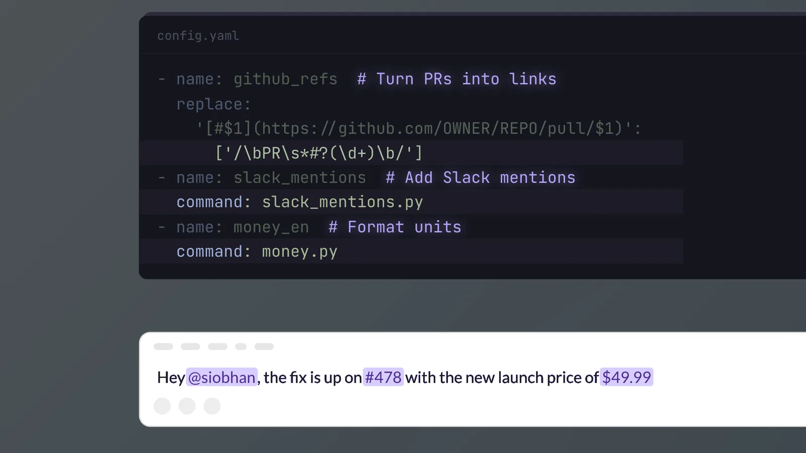
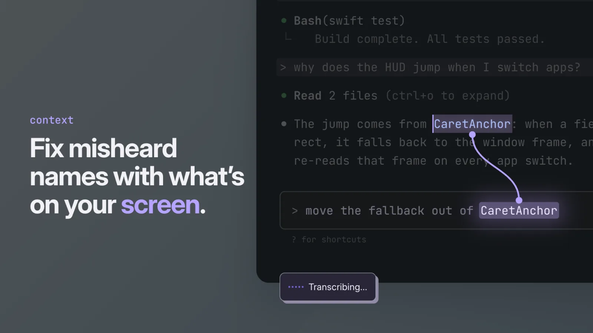
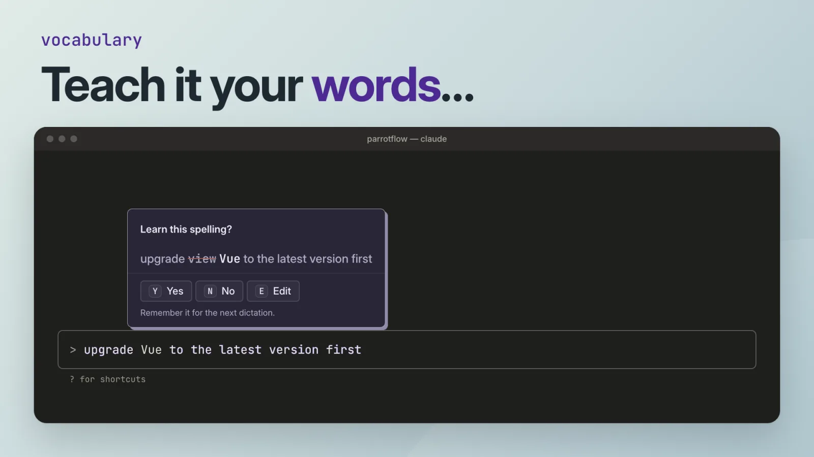
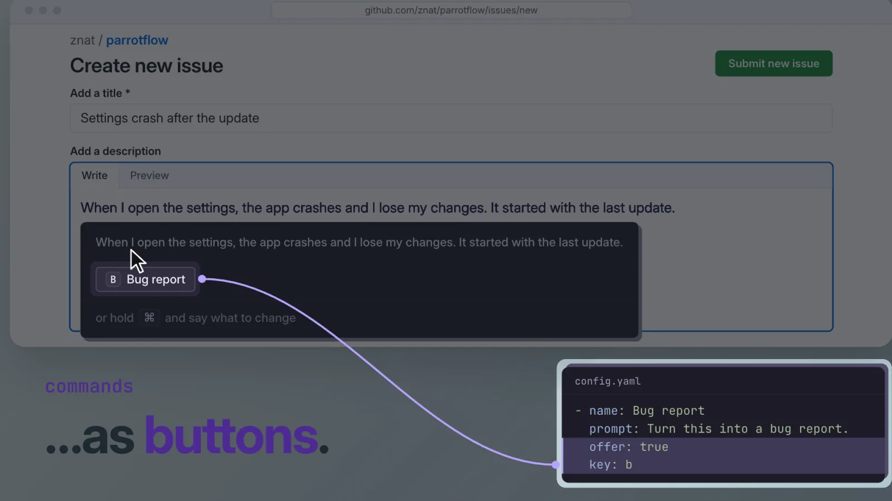
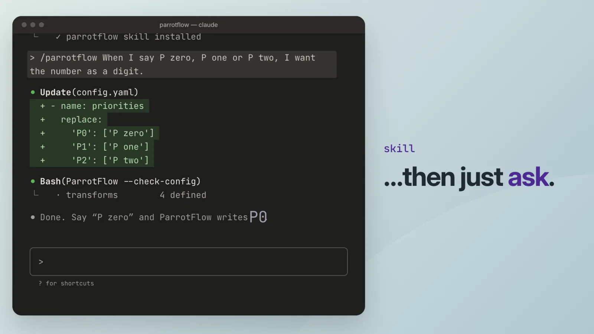

<div align="center">


# ParrotFlow

## Dictation for builders.

Local dictation for macOS that you can program.

[](https://github.com/znat/parrotflow/releases)


**[Install](#install)** · [What it does](#what-it-does) · [Documentation](docs/README.md)

</div>

https://github.com/user-attachments/assets/bfdeb558-cd49-4a70-8605-a5ede1bd8f00

<br>

## Install

ParrotFlow needs Apple silicon and macOS 15+. It uses about 2 GB of disk and 1 GB of memory.

```sh
brew install znat/tap/parrotflow
```

<details>
<summary>Not using <a href="https://brew.sh">Homebrew</a>?</summary>

<br>

The script installs the same app, in the same place.

```sh
curl -fsSL https://raw.githubusercontent.com/znat/parrotflow/main/scripts/install.sh | sh
```

</details>

<br>

## What it does

Five things, one example each. Each picture is a still from the video, and the
config under it is what does it.

### 1. Your own rules

A rule is a pattern and what replaces it, or a small script of your own.
These three turn a PR number into a link, a first name into a Slack mention,
and a spoken price into digits.



> *"PR 478"* → ***#478*** &nbsp;·&nbsp; *"Siobhan"* → ***&#64;siobhan*** &nbsp;·&nbsp; *"forty nine dollars ninety nine"* → ***$49.99***

```yaml
transforms:
  - name: github_refs        # Turn PRs into links
    replace:
      '[#$1](https://github.com/OWNER/REPO/pull/$1)':
        ['/\bPR\s*#?(\d+)\b/']
  - name: slack_mentions     # Add Slack mentions
    command: slack_mentions.py
  - name: money_en           # Format units
    command: money.py
```

### 2. Context

Claude Code just wrote `CaretAnchor`. You say it, and the recogniser hears
"carrot anchor". ParrotFlow reads the window you dictate into and writes
`CaretAnchor`. It reads the whole window in a terminal or Slack, and the text
before the caret anywhere else. The screen is read on your Mac, when you press
the key, and needs the Accessibility permission.



> *"carrot anchor"* → ***CaretAnchor***

```yaml
transcription:
  context_spelling: {enabled: true}   # on by default
```

### 3. Vocabulary

Fix a word once and the pill offers to learn it: Y to keep it, N to skip.
Next time, "upgrade view" becomes "upgrade Vue". In "re-render the whole
view", the word stays "view".



> *"upgrade view"* → *"upgrade **Vue**"* &nbsp;·&nbsp; *"the whole view"* stays *"the whole view"*

```yaml
transcription:
  vocabulary: {enabled: true}         # on by default
```

### 4. Commands as buttons

Write a prompt and add `offer: true` with a key. After you dictate, the pill
shows it as a button. Press B and the dictation becomes a bug report. This is
the only kind of step that rewrites your text with a model, and only when you
add one. It runs on the model you choose, local or in the cloud: see
[Use language models only when they're needed](#use-language-models-only-when-theyre-needed).



```yaml
transforms:
  - name: Bug report
    prompt: Turn this into a bug report.
    offer: true
    key: b
```

### 5. The ParrotFlow skill

Add the ParrotFlow skill to your coding agent, then describe the rule in your
own words. The agent writes it into `config.yaml` and checks it with
`ParrotFlow --check-config`.



```sh
npx skills add znat/parrotflow --skill parrotflow
```

To match the skill to the app version you run, name its tag:

<!-- x-release-please-start-version -->
```sh
npx skills add 'znat/parrotflow#v0.17.0@parrotflow'
```
<!-- x-release-please-end -->

> /parrotflow When I say P zero, P one or P two, I want the number as a digit.

```yaml
transforms:
  - name: priorities
    replace:
      'P0': ['P zero']
      'P1': ['P one']
      'P2': ['P two']

transcription:
  pipeline:
    # ...your other steps
    - transform: priorities   # without a step, the rule never runs
```

<br>

## Truly local and extensible

**ParrotFlow uses very small models**, such as mmBERT, the Qwen3 0.6B family and spaCy, to understand what you mean, use your vocabulary in context, correct hesitations and repair raw ASR output without relying on a powerful LLM to rewrite what you said.


<table>
<thead>
<tr><th></th><th>ParrotFlow</th><th>Local<sup>1</sup></th><th>Cloud<sup>2</sup></th></tr>
</thead>
<tbody>
<tr><td>🔒 <b>Truly local</b></td><td align="center">✅</td><td align="center">✅</td><td align="center">❌</td></tr>
<tr><td>✍️ <b>Keeps your wording</b><sup>3</sup> — no LLM rewrites it</td><td align="center">✅</td><td align="center">❌</td><td align="center">❌</td></tr>
<tr><td>📖 <b>Knows your vocabulary</b> — and where it belongs</td><td align="center">✅</td><td align="center">❌</td><td align="center">❌</td></tr>
<tr><td>🧩 <b>Extensible</b> — your own rules, prompts and scripts</td><td align="center">✅</td><td align="center">❌</td><td align="center">❌</td></tr>
<tr><td>🔑 <b>No cloud key</b> — for any built-in step</td><td align="center">✅</td><td align="center">❌<sup>4</sup></td><td align="center">❌</td></tr>
</tbody>
</table>

<sub><sup>1</sup> Handy, VoiceInk, MacWhisper, FluidVoice. &nbsp;<sup>2</sup> Wispr Flow, Aqua, Willow. &nbsp;<sup>3</sup> Built-in steps never rewrite. A prompt step that does is yours to add. &nbsp;<sup>4</sup> FluidVoice bundles a local rewrite model.</sub>

<br>

## Extend with rules, prompts and scripts

> [!TIP]
> These examples go one step further than [What it does](#what-it-does).

What makes ParrotFlow truly unique is that you can fully customize it with regular expressions, prompts or scripts.
All you have to do is point your coding agent to your `config.yaml` file and ask what you need.

<br>

**Example: Automatically add Slack mentions.**

```yaml
transforms:
  - name: slack_mentions
    description: turn people's names into Slack mentions
    display: Slack Mentions          # what the menu bar says while it runs
    offer: true                      # a chip on the pill after each dictation
    key: s                           # press S to run it
    say: [slack mentions, mentions]  # hold the hotkey and say either one
    command: slack_mentions.py
```

`offer`, `key` and `say` are three ways to run a transform on demand: a chip
on the pill, a letter, or your voice. A transform that should run on every
dictation goes in the pipeline instead.

Where `slack_mentions.py` is:

```python
#!/usr/bin/env python3
import re, sys

ROSTER = {"Ada": "@ada.lovelace"}
text = sys.stdin.read()

for name, handle in ROSTER.items():
    # Skip a name already written as a handle. Case-sensitive, so
    # "mark it as done" is not Mark.
    text = re.sub(rf"(?<![@\w.]){re.escape(name)}\b", handle, text)

sys.stdout.write(text)
```

This one ships. Open `transforms/slack_mentions/slack_mentions.py` beside your
config and fill the roster.

<br>

**Combine transforms in a pipeline**

```yaml
transcription:
  pipeline:
    - transform: numbers_en   # "one two three" -> 123, so github_refs has digits
    - transform: github_refs
```

`slack_mentions` stays out of the pipeline on purpose: a message that names
someone is not always a message that should ping them. Keep it on the pill.

<br>

## Use language models only when they're needed

You can use LLMs for prompt transforms, for example fixing grammar, formatting your dictation as an email, bulletizing an enumeration, anything.
> Note: An LLM is not required to benefit from all the features above.

```yaml
models:
  gemma:               # on your Mac, through Ollama
    api: ollama
    model: gemma4:e4b-mlx
    default: true      # what a transform runs on when it names no model
  gpt:                 # remote, for the harder jobs
    api: openai
    model: gpt-5.6-luna
```

<br>

**A small local model** does quick, solid rewrites on your Mac: grammar, tone,
structure. Gemma through [Ollama](https://ollama.com/download) is the one this
example names.

```yaml
transforms:
  - name: grammar
    description: fix grammar and punctuation
    model: gemma       # stays on your Mac
    offer: true        # put a chip on the pill after every dictation
    key: g             # press G to run it
    say: [Fix grammar] # Hold the hotkey, say "Fix grammar"
    prompt: Fix grammar and punctuation...
```

> See [built-in/transforms/grammar](built-in/transforms/grammar) for a more elaborate version.
<br>
Or you can run the grammar fix in chat and mail apps (but not in coding agents, for instance) for all dictations:

```yaml
transcription:
  pipeline:
    - transform: grammar
      app: /slack|outlook/    # Grammar only checked in Slack and Outlook
```

You can define very granular conditions for pipeline stages — on the text so
far, on the app being dictated into, or on your own variables. See
[Conditions](docs/pipelines.md#conditions) and [Apps](docs/pipelines.md#apps).

### More examples

Each with its own test cases, in [built-in/transforms](built-in/transforms).
`fillers`, `dates`, `numbers`, `money` and `disfluency` are in the pipeline a
new install gets; the rest ship with no step — see [What ships
unwired](docs/pipelines.md#what-ships-unwired).

- [numbers](built-in/transforms/numbers) — spoken numbers as digits, one
  script per language: *"two hundred forty-three"* → `243`,
  *"soixante-quinze pour cent"* → `75%`.
- [disfluency](built-in/transforms/disfluency) — what you did not mean to say,
  taken out: a word said twice, *"the the prompt"* → *"the prompt"*; a phrase
  begun again, *"in the ter in the terminal"*; and a marker that carries
  nothing, *"so use like you know five"* → *"so use five"*. Only that last one
  wants a parse; the rest are string work.
- [dates](built-in/transforms/dates) — a dictated date or time in the shape it
  was said, *"at ten fifteen"* → *"at 10:15"*. One script per language, above
  the numbers step; English is in the pipeline and French is two lines of
  config away.

[Pipelines](docs/pipelines.md) · [Writing a transform](docs/authoring.md) ·
[Where the time goes](docs/architecture.md#where-the-time-goes)

<br>

## Documentation

> [!TIP]
> Point your coding agent at this
> repo and say what you want. It can edit `config.yaml`, write a transform's
> prompt or script, and harden it against real test cases before you trust
> it — start at [AGENTS.md](AGENTS.md).

**[docs/README.md](docs/README.md)** — configuration, pipelines, transforms, the
command line, permissions, architecture.

**[CONTRIBUTING.md](.github/CONTRIBUTING.md)** — build it, test it, send a change.
Questions that are not bugs go to
[Discussions](https://github.com/znat/parrotflow/discussions).

---

## License

[GPL-3.0](LICENSE)

<div align="center">

macOS dictation · offline speech to text · local voice typing · open source
Wispr Flow alternative · privacy-first transcription · Parakeet · Ollama

</div>
