# The agent's rules, as trees

Every rule the "act where you look" agent applies, as the code does it today. Diamonds are the questions, boxes are what happens. A dashed box is a rule in the prompt only; a thick box is what the user sees. Each node's italic id is in the [node index](#node-index) with its file and line.

## 0. A request arrives

The runner tries a recipe first. The agent runs when no recipe fits. `loop: plan` from an older config runs the agent too.

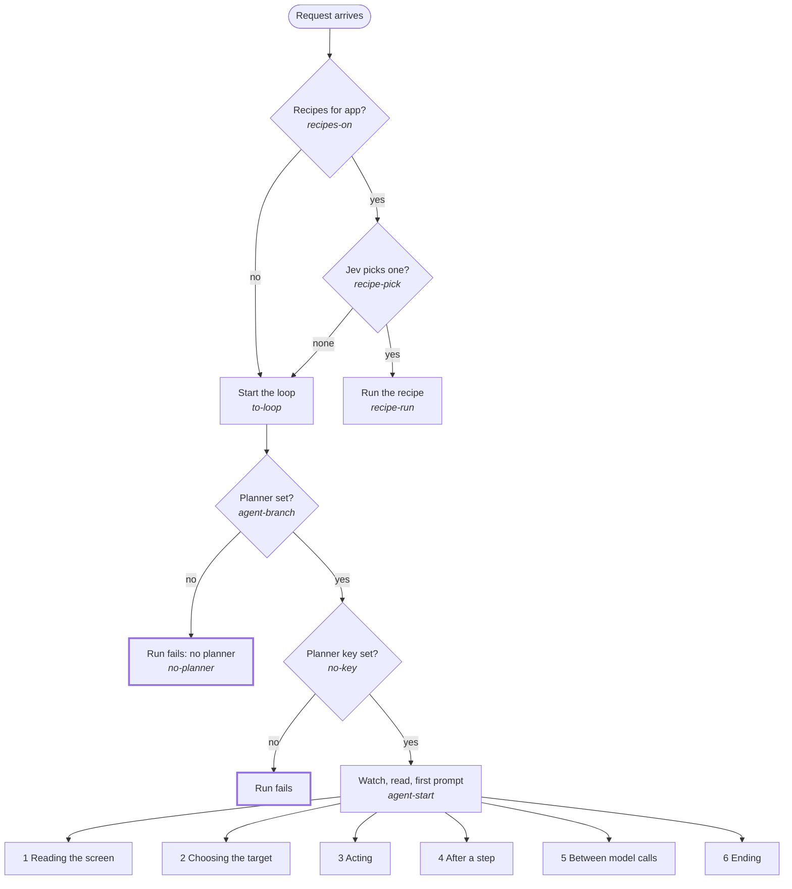

## 1. Reading the screen

The app walks the accessibility tree of the run's app. The agent turns the result into numbered lines, and adds text read from pixels and one picture.

### 1a. The walk (Swift)

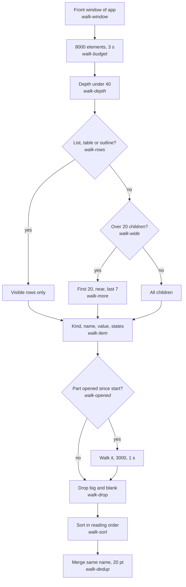

### 1b. The lines the model reads

A read's lines hold the tree only. Text read from pixels shows up in step results and `look` results, never here.

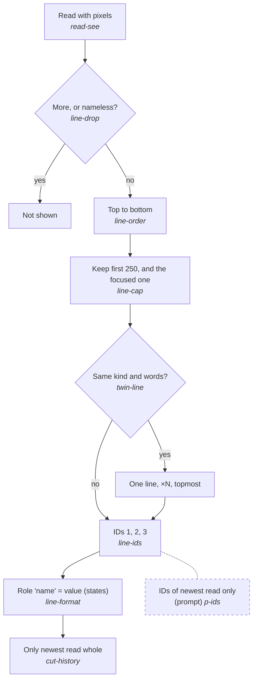

### 1c. Text read from pixels

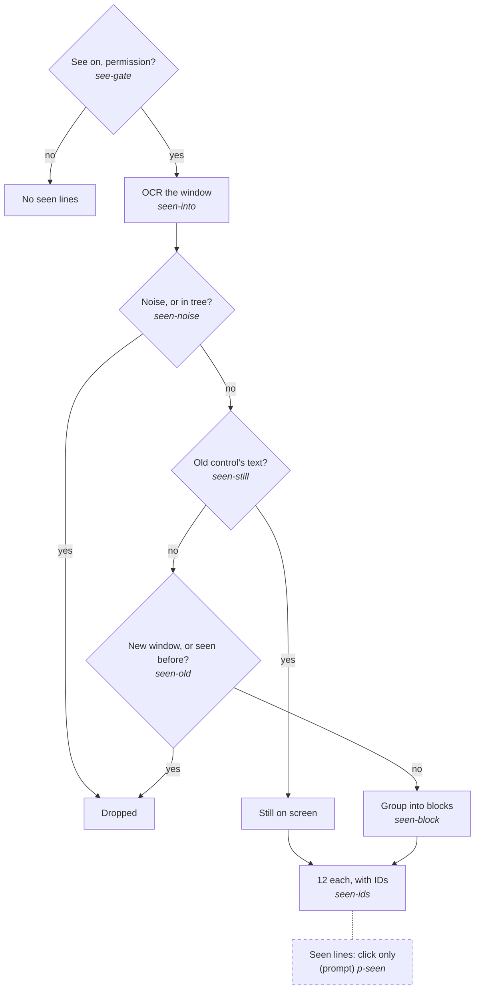

### 1d. The picture

One picture per request, 512 px on the long side, `detail: low`. The one before is dropped. There is no aim on the first call; after each step it is the focus or the last target.

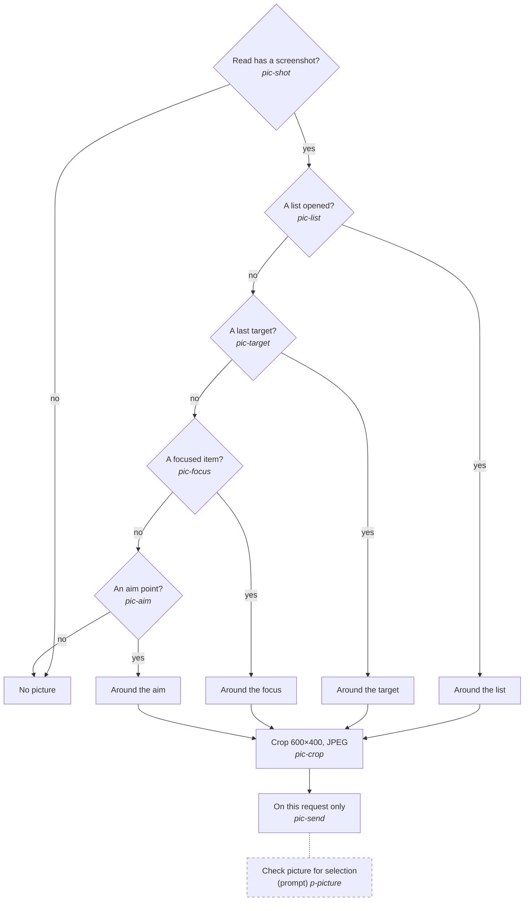

## 2. Choosing the target

A step names its target by ID. An ID is an element of the newest read, a line seen in pixels, or a point from `ground`.

### 2a. From step ID to element

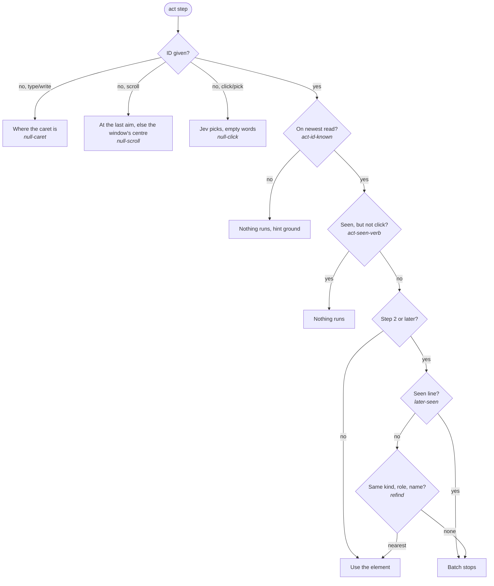

### 2b. `ground`: a point from pixels

The tool and its prompt line exist only when `actions.ground` is on.

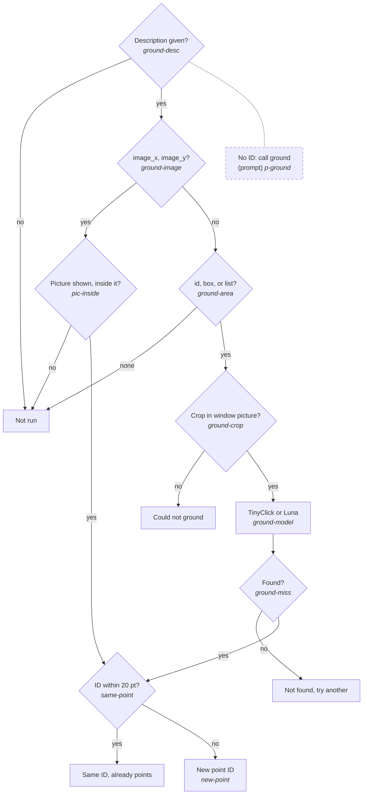

### 2c. `look`: text lines from pixels

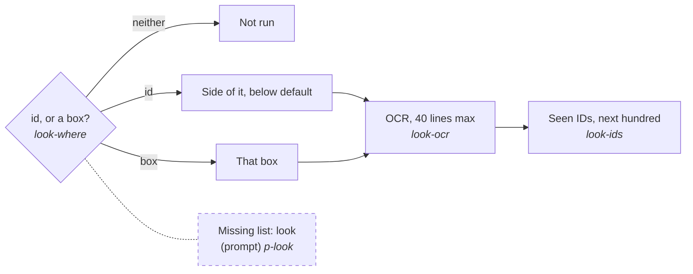

## 3. Acting

Each step runs through `Loop._step`. The app posts the events and applies the last guards.

### 3a. click and pick

The open-list check runs only for a field or a control that opens a list. The cover check runs only for a target 60 pt high or less, while another control is expanded. A seen line's real click stops the run when another app is in front. A press has no front check.

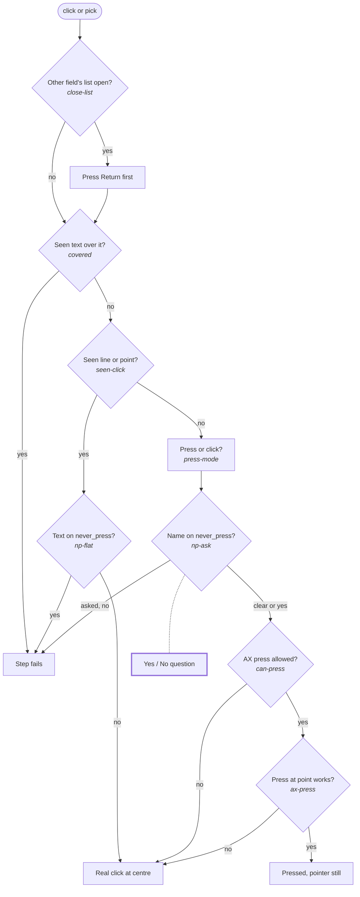

### 3b. type and write

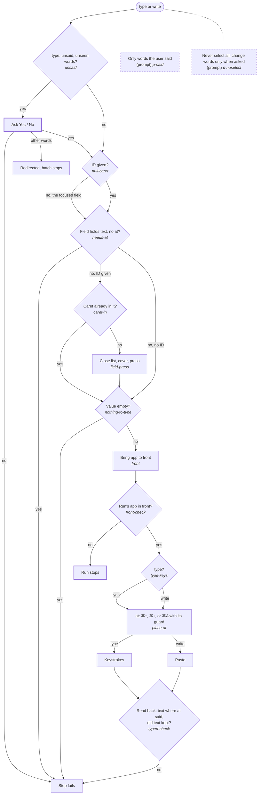

### 3c. key, scroll, and the app's guards

The Return rule applies only when `send` is off. A "no" to it ends the run, not only the step.

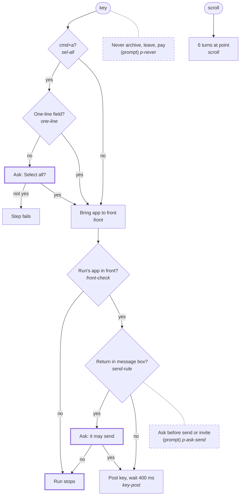

### 3d. caret and select

The model names words the field holds. Code finds them and the app moves the caret.

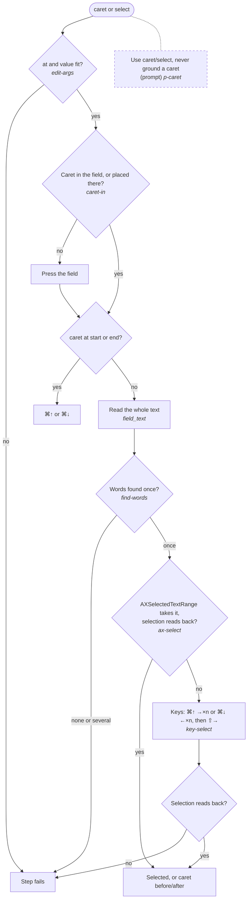

## 4. After a step

The runner reads the window again and compares. Then the agent decides whether the batch goes on.

### 4a. Reading what changed

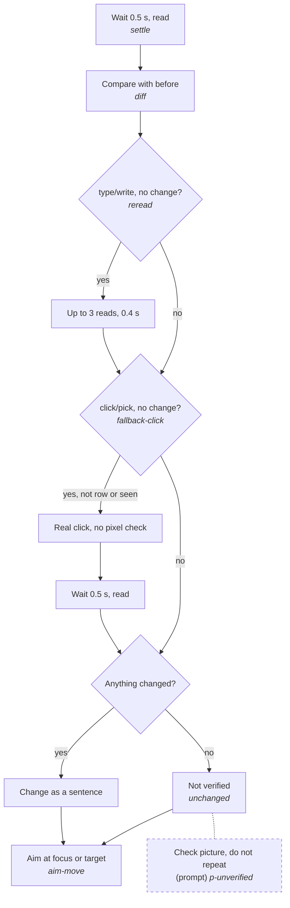

### 4b. Does the batch go on?

A "surprise" counts toward the forced question (see 5).

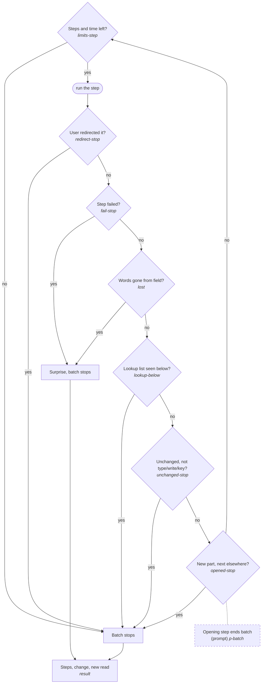

## 5. Between model calls

The runner watches for loops and for a model that will not ask.

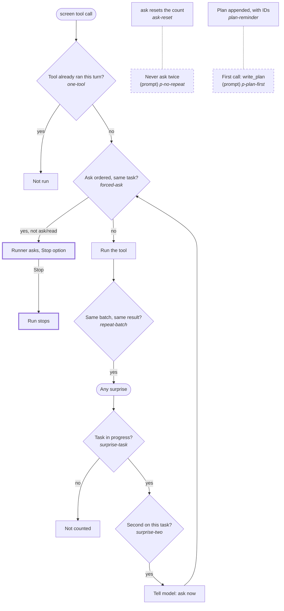

## 6. Ending

### 6a. Limits and Escape

The 240 s clock stops while a question waits for the user. `max_steps` is 30 by default.

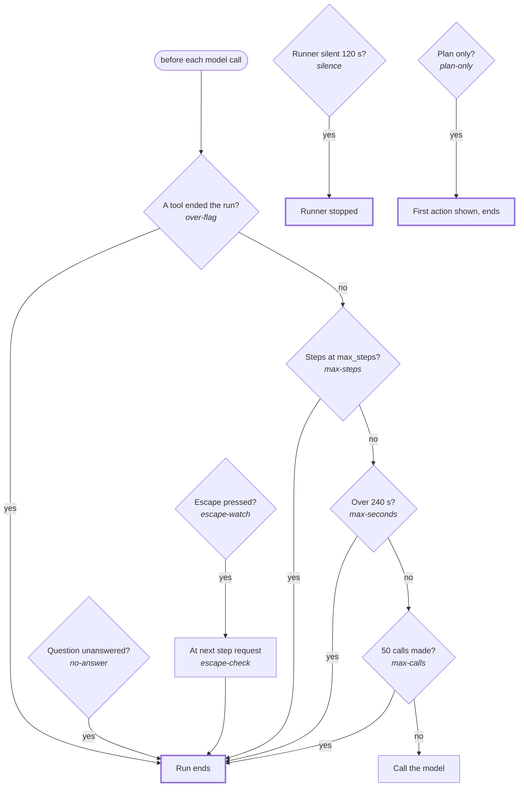

### 6b. `done` and `stuck`

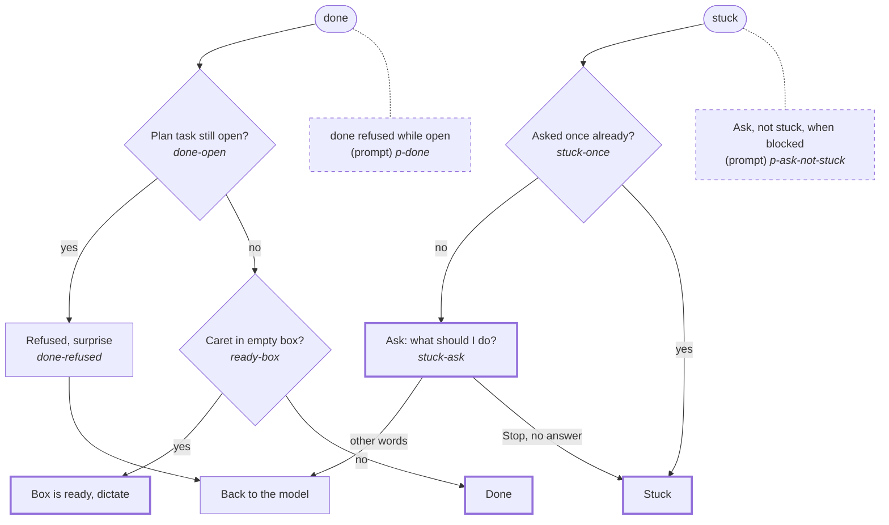

## Node index

Python files are in `built-in/recipes/`. Swift files are in `Sources/ParrotFlow/`.

| node id | file:line |
|---|---|
| recipes-on | runner.py:429 |
| recipe-pick | runner.py:439 |
| recipe-run | runner.py:468 |
| to-loop | runner.py:400 |
| agent-branch | loop.py:575 |
| no-planner | loop.py:576 |
| no-key | agent.py:306 |
| agent-start | agent.py:290 |
| walk-window | ScreenTargets.swift:218 |
| walk-budget | ScreenTargets.swift:837 |
| walk-depth | ScreenTargets.swift:1033 |
| walk-rows | ScreenTargets.swift:979 |
| walk-wide | ScreenTargets.swift:989 |
| walk-more | ScreenTargets.swift:1000 |
| walk-item | ScreenTargets.swift:1057 |
| walk-opened | ScreenTargets.swift:236 |
| walk-drop | ScreenTargets.swift:878, 887 |
| walk-sort | ScreenTargets.swift:899 |
| walk-dedup | ScreenTargets.swift:905 |
| read-see | loop.py:970 |
| line-drop | agent.py:1027 |
| line-order | agent.py:1029 |
| line-cap | agent.py:1031 |
| twin-line | agent.py:1034 |
| line-ids | agent.py:1046 |
| line-format | planner.py:195 |
| cut-history | agent.py:1076 |
| p-ids | agent.py:101 |
| see-gate | RecipeRunner.swift:646 |
| seen-into | loop.py:974 |
| seen-noise | loop.py:390 |
| seen-still | loop.py:392 |
| seen-old | loop.py:400 |
| seen-block | loop.py:404 |
| seen-ids | agent.py:645 |
| p-seen | agent.py:104 |
| pic-shot | agent.py:944 |
| pic-list | agent.py:946 |
| pic-target | agent.py:948 |
| pic-focus | agent.py:949 |
| pic-aim | agent.py:953 |
| pic-crop | agent.py:959 |
| pic-send | agent.py:1113 |
| p-picture | agent.py:121 |
| null-caret | loop.py:1140 |
| null-scroll | loop.py:1138 |
| null-click | loop.py:1147 |
| act-id-known | agent.py:556 |
| act-seen-verb | agent.py:562 |
| later-seen | agent.py:578 |
| refind | agent.py:1014 |
| ground-desc | agent.py:833 |
| ground-image | agent.py:836 |
| pic-inside | agent.py:890 |
| ground-area | agent.py:859 |
| ground-crop | agent.py:843 |
| ground-model | agent.py:848 |
| ground-miss | agent.py:853 |
| same-point | agent.py:917 |
| new-point | agent.py:921 |
| p-ground | agent.py:122 |
| look-where | agent.py:734 |
| look-ocr | agent.py:761 |
| look-ids | agent.py:775 |
| p-look | agent.py:103 |
| close-list | loop.py:1227 |
| covered | loop.py:1257 |
| seen-click | loop.py:1166 |
| np-flat | RecipeRunner.swift:800 |
| press-mode | loop.py:1174 |
| np-ask | RecipeRunner.swift:886 |
| can-press | ScreenAction.swift:56 |
| ax-press | ScreenTargets.swift:303 |
| unsaid | loop.py:1105 |
| caret-in | loop.py:1056 |
| field-press | loop.py:1151 |
| nothing-to-type | loop.py:1179 |
| type-keys | loop.py:1185 |
| needs-at | loop.py `_where` |
| place-at | loop.py `_place` |
| typed-check | loop.py `_typed` |
| edit-args | loop.py `_edit_problem` |
| find-words | loop.py `find_words`, `_edit` |
| ax-select | TextCaret.swift `select` |
| key-select | TextCaret.swift `byKeys` |
| p-caret | agent.py `SYSTEM`, `GROUNDING` |
| p-said | agent.py:108 |
| p-noselect | agent.py:109 |
| sel-all | loop.py:1115 |
| one-line | loop.py:1117 |
| front | RecipeRunner.swift:716 |
| front-check | RecipeRunner.swift:466 |
| send-rule | RecipeRunner.swift:510 |
| key-post | RecipeRunner.swift:523 |
| scroll | ScreenAction.swift:204 |
| p-ask-send | agent.py:113 |
| p-never | agent.py:110 |
| settle | loop.py:1187 |
| diff | loop.py:166 |
| reread | loop.py:1192 |
| fallback-click | loop.py:1202 |
| unchanged | loop.py:1213 |
| aim-move | loop.py:1220 |
| p-unverified | agent.py:118 |
| limits-step | agent.py:573 |
| redirect-stop | agent.py:602 |
| fail-stop | agent.py:607 |
| lost | loop.py:527 |
| lookup-below | agent.py:594 |
| unchanged-stop | agent.py:765 |
| opened-stop | agent.py:636, 640 |
| result | agent.py:668 |
| p-batch | agent.py:106 |
| one-tool | agent.py:466 |
| forced-ask | agent.py:470 |
| repeat-batch | agent.py:536 |
| surprise-task | agent.py:710 |
| surprise-two | agent.py:715 |
| ask-reset | agent.py:995 |
| plan-reminder | agent.py:1198 |
| p-no-repeat | agent.py:115 |
| p-plan-first | agent.py:119 |
| over-flag | agent.py:361 |
| max-steps | agent.py:363 |
| max-seconds | agent.py:365 |
| max-calls | agent.py:351 |
| no-answer | agent.py:1001 |
| escape-watch | RecipeRunner.swift:13 |
| escape-check | RecipeRunner.swift:183 |
| silence | RecipeRunner.swift:147 |
| plan-only | agent.py:416 |
| done-open | agent.py:1152 |
| done-refused | agent.py:1154 |
| ready-box | agent.py:408 |
| stuck-once | agent.py:1158 |
| stuck-ask | agent.py:1163 |
| p-ask-not-stuck | agent.py:114 |
| p-done | agent.py:120 |
